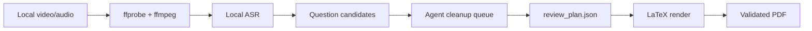

# InterviewForge

<p align="center">
  <a href="README.md">中文</a> · <b>English</b>
</p>

<p align="center">
  <b>Forge local interview recordings into polished, source-backed review PDFs.</b>
</p>

<p align="center">
  <a href="https://github.com/K1XE/InterviewForge/actions/workflows/ci.yml"></a>
  <a href="LICENSE"></a>
  
  
  
</p>

InterviewForge turns a local interview video or audio file into a structured Chinese review report:

- 🎙️ extract and normalize local transcript evidence;
- 🧭 recover interviewer questions with high recall;
- ✍️ rewrite the candidate's real answers into readable cleaned prose;
- 🧪 add compact quality labels such as `passable 3/5` or `risky 2/5`;
- 📚 attach short suggested answers, sources, and follow-up learning resources;
- 📄 render a polished LaTeX PDF and validate it with PDF tooling.

It ships as both a reusable agent skill and a normal CLI.

| Surface | Path / Command | Use it when |
|---|---|---|
| Codex / agent skill | `skill/interview-video-review/` | You want an agent to inspect transcripts and write the judgment-heavy review plan. |
| CLI | `interviewforge` | You want deterministic local steps, sample generation, rendering, and validation. |
| LaTeX template | `skill/interview-video-review/assets/interview-review-template.tex` | You want to customize the PDF style. |

## 🧩 Pipeline



The deterministic scripts handle media probing, audio extraction, transcript normalization, scaffolding, rendering, and validation. The agent/LLM step is intentionally explicit: it reviews `answer_polish_queue.json` and writes `question_cleaned` plus `my_answer_cleaned` so the report does not read like raw ASR.

## 📦 Output

Each run uses a clean two-level layout:

```text
interview_review.pdf
references.md
supporting_files/
  review_plan.json
  transcript_normalized.json
  interview_events.json
  source_registry.json
  question_candidates.json
  answer_polish_queue.json
  interview_review.tex
  quality_report.json
```

The final PDF is not a transcript dump. It is optimized for pre-interview review:

| Section | Purpose |
|---|---|
| 首页摘要 | Fast verdict, risks, strengths, and next priorities. |
| 面试官问题与我的回答 | Main body: concrete questions and cleaned real answers. |
| 重点追问复盘 | The 5-8 questions most likely to affect interview judgment. |
| 代码题复盘 | Problem, approach, mistakes, template, complexity, oral script. |
| 高风险技术点速记 | Short formula/rule cards for technical corrections. |
| 参考来源 | Local evidence and public technical sources. |
| 后续巩固资料 | 5-8 follow-up resources matched to exposed gaps. |

## 🚀 Install

```bash
git clone https://github.com/K1XE/InterviewForge.git
cd InterviewForge
python3 -m pip install --upgrade pip setuptools wheel
python3 -m pip install -e .
```

System tools for the full video pipeline:

| Tool | Why |
|---|---|
| `ffmpeg`, `ffprobe` | Media probing and local audio extraction. |
| `whisperx`, `mlx-whisper`, `faster-whisper`, or `openai-whisper` | Local ASR backend. |
| `latexmk`, `xelatex`, `texlive-lang-chinese` or equivalent | PDF rendering with Chinese support. |
| `pdfinfo`, `pdffonts`, `pdftotext` | Report validation. |

## ⚡ Quick Start

Generate the fictional sample report:

```bash
interviewforge sample --out /tmp/interviewforge-sample
open /tmp/interviewforge-sample/interview_review.pdf
```

Render and validate an existing `review_plan.json`:

```bash
interviewforge render --workdir /path/to/run
interviewforge validate --workdir /path/to/run
```

Use the deterministic pipeline directly:

```bash
interviewforge init --workdir /path/to/run --input /path/to/interview.mov
interviewforge pipeline probe --input /path/to/interview.mov --out-dir /path/to/run/supporting_files
interviewforge pipeline extract-audio --input /path/to/interview.mov --audio /path/to/run/supporting_files/audio.wav
```

| Command | What it does |
|---|---|
| `interviewforge sample --out <dir>` | Builds a fictional minimal PDF for smoke testing. |
| `interviewforge init --workdir <dir>` | Creates the clean run layout. |
| `interviewforge pipeline ...` | Passes through to bundled deterministic pipeline subcommands. |
| `interviewforge render --workdir <dir>` | Renders and compiles `supporting_files/review_plan.json`. |
| `interviewforge validate --workdir <dir>` | Checks PDF, sections, sources, labels, and extractable text. |

## 🛡️ Privacy Defaults

Interview recordings are sensitive, so the defaults are conservative.

| Default | Behavior |
|---|---|
| No upload | Audio, video, transcripts, screenshots, and reports stay local unless you choose otherwise. |
| No personal examples | The repository contains only fictional sample data. |
| No absolute paths in reports | Local evidence is shown as event ids, artifact ids, and time ranges. |
| Transient media artifacts | Extracted audio and LaTeX intermediates are not meant to be committed. |
| Source discipline | Interview facts cite local evidence; technical corrections cite traceable public sources. |

## 🧠 Skill Usage

The skill entrypoint is:

```text
skill/interview-video-review/SKILL.md
```

Install or symlink that directory into your agent skill root. The skill includes:

- report writing rules;
- JSON data contracts;
- privacy defaults;
- LaTeX template;
- validation checklist;
- compact formula/reference cards.

## 🧪 Example

The fictional sample lives in `examples/minimal/`:

| File | Description |
|---|---|
| `review_plan.sample.json` | Complete compact sourced report plan. |
| `transcript.sample.json` | Tiny fictional transcript. |
| `question_candidates.sample.json` | Tiny fictional question candidate list. |
| `interview_review.pdf` | Pre-rendered sample output. |

## ✅ Validation

CI checks:

- Python syntax for the CLI and bundled scripts;
- editable install;
- minimal sample PDF generation;
- report validation with `validate_report.py`.

Local validation for a real run should also include:

```bash
pdftotext interview_review.pdf -
pdffonts interview_review.pdf
pdfinfo interview_review.pdf
```

## 🙏 Acknowledgements

Inspired by [`wdkns/wdkns-skills`](https://github.com/wdkns/wdkns-skills), especially its PDF-rendering skill patterns.

## 📄 License

MIT
