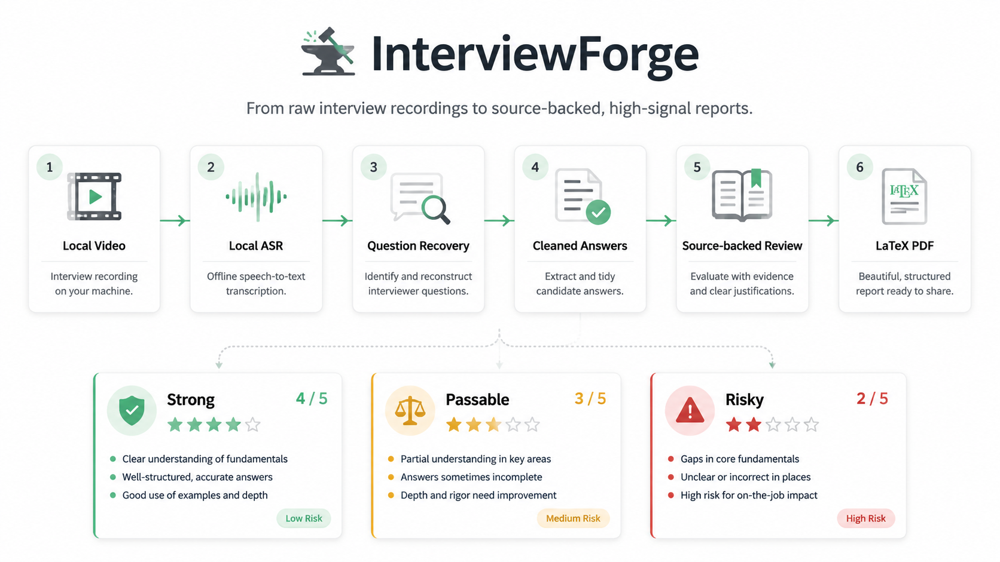
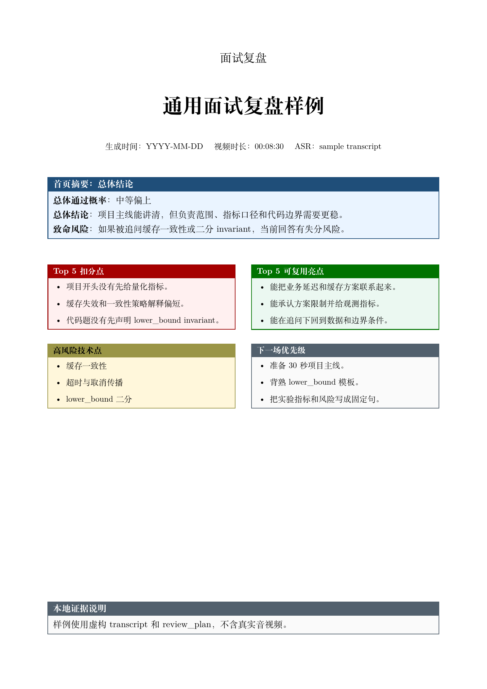
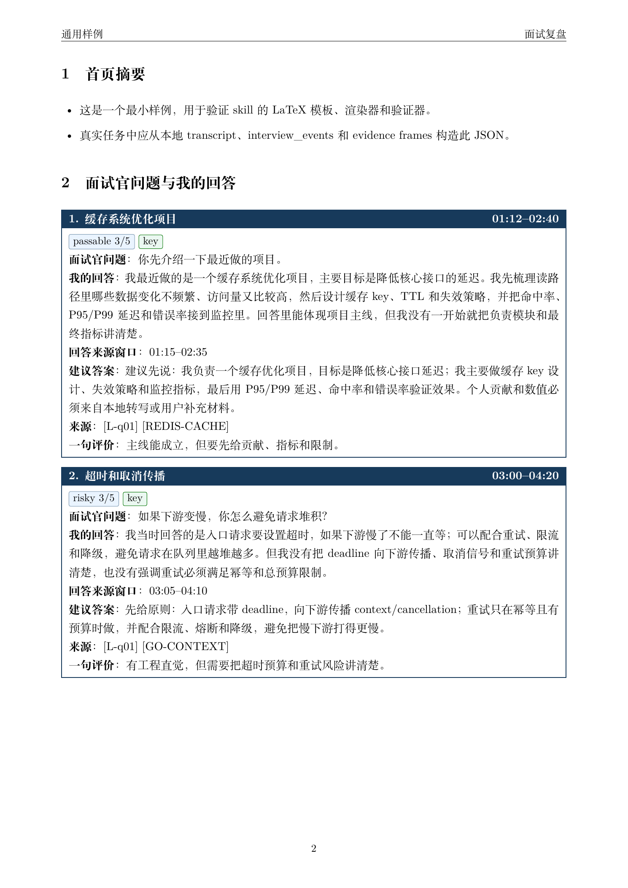
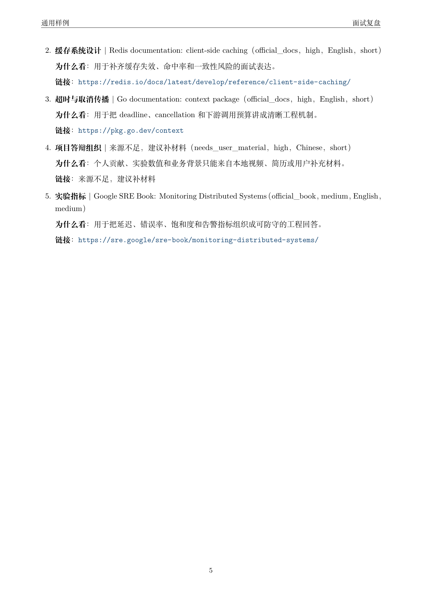
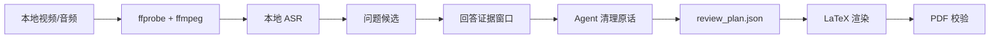

# InterviewForge

<p align="center">
  <b>把本地面试录屏锻造成结构化、可追溯、可复习的中文 PDF 面试复盘。</b>
</p>

<p align="center">
  <b>中文</b> · <a href="README.en.md">English</a>
</p>

<p align="center">
  <a href="https://github.com/K1XE/InterviewForge/actions/workflows/ci.yml"></a>
  <a href="LICENSE"></a>
  
  
  
  
  
  
  
</p>

<p align="center">
  
</p>

InterviewForge 面向本地面试视频、面试录音和 mock interview。它不是逐字稿排版器，也不是课程笔记生成器；它更像一份面试后的作战复盘：尽量完整地记录面试官问了什么、你真实答了什么、哪些回答有风险、下次可以怎么更稳。

核心输出是一份中文 LaTeX PDF：

- 🎙️ 从本地音视频抽取和规范化转写证据；
- 🧭 高召回恢复面试官问题，而不是只挑 5-6 个摘要问题；
- ✍️ 把候选人的真实回答整理成可读的“清理原话”；
- 🧪 给每题加 `strong / passable / risky / weak` 质量标签和 `1-5` 分；
- 📚 为建议答案、技术纠正和后续资料附上可追溯来源；
- 📄 用 LaTeX 生成适合打印和复习的 PDF，并用 PDF 工具校验。

## 🧠 Agent 集成

InterviewForge 可以直接作为 Agent Skill 使用，入口是 [`skill/interviewforge/SKILL.md`](skill/interviewforge/SKILL.md)。如果你想让自己的 AI 助手安装并配置它，可以直接把这句话发给 Codex、Claude Code、OpenCode、Qwen Code、Copilot、Gemini CLI、Cursor、Aider、Cline 或 Roo Code：

```text
请你帮我安装一下 https://github.com/K1XE/InterviewForge
```

面向 agent 的详细安装说明在 [`AGENTS.md`](AGENTS.md)，包括各类 coding agent / coding CLI 的 skill 目录、软链接方式和旧名迁移。

## 🚀 安装 CLI

```bash
git clone https://github.com/K1XE/InterviewForge.git
cd InterviewForge
python3 -m pip install --upgrade pip setuptools wheel
python3 -m pip install -e .
```

完整视频流水线建议本机准备：

| 工具 | 用途 |
|---|---|
| `ffmpeg` / `ffprobe` | 媒体探测和本地音频抽取 |
| WhisperX / faster-whisper / mlx-whisper / openai-whisper | 本地 ASR 后端 |
| `latexmk` / `xelatex` | 中文 LaTeX PDF 编译 |
| `pdfinfo` / `pdffonts` / `pdftotext` | PDF 校验 |

## ⚡ 快速开始

生成虚构样例：

```bash
interviewforge sample --out /tmp/interviewforge-sample
open /tmp/interviewforge-sample/interview_review.pdf
```

渲染已有 `review_plan.json`：

```bash
interviewforge render --workdir /path/to/run
interviewforge validate --workdir /path/to/run
```

处理真实本地视频的最小流程：

```bash
interviewforge init --workdir /path/to/run --input /path/to/interview.mov
interviewforge pipeline probe --input /path/to/interview.mov --out-dir /path/to/run/supporting_files
interviewforge pipeline extract-audio --input /path/to/interview.mov --audio /path/to/run/supporting_files/audio.wav
```

之后用本地 ASR 生成 transcript，再按 skill 流程抽取问题、整理回答、生成 `review_plan.json`，最后执行：

```bash
interviewforge render --workdir /path/to/run
interviewforge validate --workdir /path/to/run
```

## ✨ 效果预览

样例使用完全虚构的缓存系统项目和二分查找代码题，不包含真实面试信息。

| 首页摘要 | 问题卡片 | 后续资料 |
|---|---|---|
|  |  |  |

样例 PDF：[`examples/minimal/interview_review.pdf`](examples/minimal/interview_review.pdf)

## 🧩 工作流



确定性脚本负责媒体探测、音频抽取、目录初始化、渲染和校验；agent/LLM 步骤负责判断更强的部分：从 `answer_polish_queue.json` 里按证据窗口清理问题和回答，避免报告读起来像原始 ASR 噪声。

## 📁 输出结构

每次运行默认使用干净的两级结构：

```text
interview_review.pdf
references.md
supporting_files/
  review_plan.json
  transcript_normalized.json
  interview_events.json
  source_registry.json
  question_candidates.json
  answer_polish_queue.json
  interview_review.tex
  quality_report.json
```

根目录只放最终报告和引用说明；可重建材料放在 `supporting_files/`。真实音视频、ASR 原始输出和 LaTeX 临时文件默认不应该提交。

## 📝 报告结构

| 章节 | 目的 |
|---|---|
| 首页摘要 | 快速结论、风险、亮点和下一场优先级 |
| 面试官问题与我的回答 | 主体内容：具体问题 + 清理后的真实回答 |
| 重点追问复盘 | 5-8 个最可能影响判断的问题 |
| 代码题复盘 | 题目、思路、错误路径、模板、复杂度和口述稿 |
| 高风险技术点速记 | 面试可用的短规则卡和技术纠正 |
| 参考来源 | 本地证据和公开技术来源 |
| 后续巩固资料 | 5-8 条和本场暴露问题匹配的学习资料 |

问题卡片通常包含：

| 字段 | 说明 |
|---|---|
| 时间 | 对应 transcript / video 时间窗 |
| 质量标签 | `strong`、`passable`、`risky`、`weak` |
| 分数 | `1/5` 到 `5/5` |
| 面试官问题 | 尽量贴近原问法 |
| 我的回答 | 清理原话，不是标准答案改写 |
| 建议答案 | 1-3 句，短而有来源 |
| 来源 | 本地事件 id 和公开技术来源 |

## 🛡️ 隐私默认值

InterviewForge 默认按隐私优先设计：

| 默认值 | 行为 |
|---|---|
| 不上传 | 视频、音频、转写、截图和报告默认留在本机 |
| 不放真实样例 | 仓库只包含虚构样例 |
| 不暴露绝对路径 | PDF 和 `references.md` 默认只显示 event id、artifact id、时间段 |
| 不编造事实 | 个人项目事实只能来自本地证据或用户补充材料 |
| 技术纠正要有来源 | 论文、官方文档、官方 repo、课程或高质量公开资料 |

## 🧪 样例

虚构样例位于 `examples/minimal/`：

| 文件 | 说明 |
|---|---|
| `review_plan.sample.json` | 完整的 sourced report plan |
| `transcript.sample.json` | 极小虚构转写 |
| `question_candidates.sample.json` | 极小虚构问题候选 |
| `interview_review.pdf` | 预渲染样例 PDF |

## ✅ 校验

CI 会检查：

- CLI 和 bundled scripts 的 Python 语法；
- editable install；
- minimal sample PDF 生成；
- `validate_report.py` 报告校验。

真实运行时也建议检查：

```bash
pdftotext interview_review.pdf -
pdffonts interview_review.pdf
pdfinfo interview_review.pdf
```

## 📚 更详细的中文介绍

我写了一篇更完整的中文介绍文档，包含使用场景、流程图、输出结构、样例截图、隐私设计和 FAQ：

[InterviewForge：本地优先的面试视频复盘工具](https://feishu.cn/wiki/OrkjwGLE2in1iBkvAFdcBVg5nCe)

## 🙏 致谢

Inspired by [`wdkns/wdkns-skills`](https://github.com/wdkns/wdkns-skills).

## 📄 License

MIT
