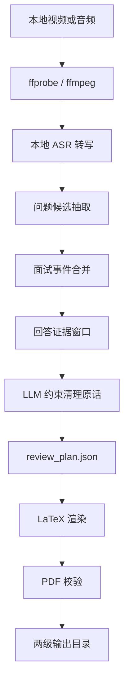

# InterviewForge：本地优先的面试视频复盘工具

> 把一段本地面试录屏，整理成一份可复盘、可追溯、可打印的中文 PDF 面试报告。

GitHub： [K1XE/InterviewForge](https://github.com/K1XE/InterviewForge)  
样例 PDF： [examples/minimal/interview_review.pdf](https://github.com/K1XE/InterviewForge/blob/main/examples/minimal/interview_review.pdf)

---

## 一句话介绍

InterviewForge 是一个 **local-first interview review toolkit**：它面向面试录屏、面试录音和 mock interview，把本地音视频整理成结构化复盘报告，重点保留：

- 面试官具体问了什么；
- 候选人真实回答了什么；
- 哪些回答 `strong / passable / risky / weak`；
- 下一次可以怎么更稳地回答；
- 技术纠正和学习资料分别来自哪些可追溯来源。

它不是课程笔记生成器，也不是逐字稿排版工具。它的目标更窄：帮你在下一场面试前快速看懂上一场到底哪里答得稳、哪里容易被追问、哪些问题需要补。

---

## 为什么需要它

很多人面试后会留下录屏，但真正复盘时会遇到几个问题：

| 痛点 | 手工处理的问题 | InterviewForge 的做法 |
|---|---|---|
| 录屏太长 | 30-90 分钟视频很难逐段回看 | 先抽取面试官问题，再按问题组织回答 |
| 转写太乱 | ASR 会有错字、断句、口癖和重复 | 保留原意，用清理原话改成可读中文 |
| 复盘太主观 | 只写“这里没答好”很难复用 | 给每题质量标签、分数和一句扣分原因 |
| 标准答案容易编 | LLM 可能把没有说过的项目事实写进去 | 面试事实只引用本地证据，技术纠正引用公开来源 |
| 隐私风险 | 面试视频、音频和项目细节不适合上传 | 默认本地处理，不上传音视频或转写 |
| 最终材料不美观 | Markdown 长文不适合打印和复习 | LaTeX 模板生成结构化 PDF |

---

## 核心能力

### 1. Skill + CLI 两种用法

InterviewForge 同时提供：

| 入口 | 适合场景 | 说明 |
|---|---|---|
| Agent Skill | 想让 Codex/agent 根据转写做判断、整理回答、补来源 | `skill/interviewforge/` |
| CLI | 想跑确定性的初始化、渲染、校验、样例生成 | `interviewforge` |

### 2. Local-first

InterviewForge 的默认设计是本地优先：

- 视频、音频、转写、截图不默认上传；
- 报告中不默认暴露本机绝对路径；
- 本地证据在 PDF 中用 `event_id`、时间段、artifact id 表示；
- 仓库只包含虚构样例，不包含真实面试数据。

### 3. 问答复盘优先

报告主体不是“知识点教程”，而是：

- 面试官问题；
- 我的回答；
- 建议答案；
- 来源；
- 质量标签和一句评价。

其中“我的回答”采用 **清理原话**：保留原回答事实顺序，只修正 ASR 错字、术语、重复、断句和口癖，不把建议答案混进去。

### 4. LaTeX PDF 输出

PDF 使用 LaTeX 模板渲染，适合打印、归档和面试前快速浏览。模板包含：

- 首页摘要；
- 问题卡片；
- 质量标签；
- 代码块；
- 参考来源；
- 后续巩固资料。

---

## 工作流



飞书如果没有渲染 Mermaid，可以按下面的文字版理解：

| 步骤 | 产物 | 作用 |
|---|---|---|
| 媒体探测 | `media_probe.json` | 获取时长、音轨、编码等基础信息 |
| 音频抽取 | `audio.wav` | 给本地 ASR 使用 |
| 本地转写 | `transcript_normalized.json` | 带时间戳的基础证据 |
| 问题抽取 | `question_candidates.json` | 尽量高召回地找出面试官提问 |
| 事件组织 | `interview_events.json` | 把问题和回答窗口组织成复盘单元 |
| 清理原话 | `review_plan.json` | 写入可读的真实回答、建议答案、来源和评分 |
| PDF 渲染 | `interview_review.pdf` | 生成最终复盘报告 |
| 校验 | `quality_report.json` | 检查章节、引用、标签、路径泄漏等 |

---

## 效果预览

下面的截图来自仓库里的虚构样例，不包含真实面试信息。

### 首页摘要


图片链接： [interviewforge-sample-cover.png](https://raw.githubusercontent.com/K1XE/InterviewForge/main/docs/assets/interviewforge-sample-cover.png)

### 问题卡片


图片链接： [interviewforge-question-card.png](https://raw.githubusercontent.com/K1XE/InterviewForge/main/docs/assets/interviewforge-question-card.png)

### 后续巩固资料


图片链接： [interviewforge-resources.png](https://raw.githubusercontent.com/K1XE/InterviewForge/main/docs/assets/interviewforge-resources.png)

---

## 快速开始

### 安装

```bash
git clone https://github.com/K1XE/InterviewForge.git
cd InterviewForge
python3 -m pip install --upgrade pip setuptools wheel
python3 -m pip install -e .
```

完整视频流水线还需要本机安装：

| 工具 | 用途 |
|---|---|
| `ffmpeg` / `ffprobe` | 本地媒体探测和音频抽取 |
| WhisperX / faster-whisper / mlx-whisper / openai-whisper | 本地 ASR |
| `latexmk` / `xelatex` | 编译中文 LaTeX PDF |
| `pdfinfo` / `pdffonts` / `pdftotext` | 验证 PDF 可读性 |

### 生成虚构样例

```bash
interviewforge sample --out /tmp/interviewforge-sample
open /tmp/interviewforge-sample/interview_review.pdf
```

### 渲染已有 review_plan

如果已经有 `supporting_files/review_plan.json`：

```bash
interviewforge render --workdir /path/to/run
interviewforge validate --workdir /path/to/run
```

### 处理真实本地视频的最小流程

```bash
interviewforge init --workdir /path/to/run --input /path/to/interview.mov
interviewforge pipeline probe --input /path/to/interview.mov --out-dir /path/to/run/supporting_files
interviewforge pipeline extract-audio --input /path/to/interview.mov --audio /path/to/run/supporting_files/audio.wav
```

之后用本地 ASR 生成 transcript，再按 skill 的流程抽取问题、清理回答、生成 `review_plan.json`，最后：

```bash
interviewforge render --workdir /path/to/run
interviewforge validate --workdir /path/to/run
```

---

## 输出结构

InterviewForge 推荐两级输出，最终用户主要看根目录，重建材料放进 `supporting_files/`：

```text
interview_review.pdf
references.md
supporting_files/
  review_plan.json
  transcript_normalized.json
  interview_events.json
  source_registry.json
  question_candidates.json
  answer_polish_queue.json
  interview_review.tex
  quality_report.json
```

| 文件 | 是否推荐保留 | 说明 |
|---|---:|---|
| `interview_review.pdf` | 是 | 最终报告 |
| `references.md` | 是 | 报告引用和后续资料链接 |
| `supporting_files/review_plan.json` | 是 | 可重渲染报告的核心结构化数据 |
| `supporting_files/transcript_normalized.json` | 视情况 | 如果想回查证据，建议保留 |
| `supporting_files/interview_events.json` | 视情况 | 面试问题和回答窗口 |
| `supporting_files/quality_report.json` | 是 | 校验结果 |
| `audio.wav`、临时 LaTeX 文件 | 否 | 默认不建议保留或提交 |

---

## 报告内容标准

### 首页摘要

首页给一个快速判断，而不是堆正文：

- 总体通过概率；
- 总体结论；
- 致命风险；
- Top 扣分点；
- Top 可复用亮点；
- 下一场优先级。

### 面试官问题与我的回答

这是报告主体。每个问题卡尽量包含：

| 字段 | 示例 |
|---|---|
| 时间 | `03:00-04:20` |
| 质量标签 | `passable 3/5`、`risky 2/5` |
| 重要性 | `key` 或 `covered` |
| 面试官问题 | 尽量贴近原问法 |
| 我的回答 | 清理原话，不是纯 ASR，也不是标准答案 |
| 建议答案 | 1-3 句，避免喧宾夺主 |
| 来源 | 本地事件 id + 必要公开技术来源 |
| 一句评价 | 只写最关键扣分点或亮点 |

### 重点追问复盘

只挑 5-8 个真正影响判断的问题，不重复大段回答，重点说明：

- 面试官可能在验证什么；
- 这题为什么危险；
- 下一次开头应该怎么答。

### 代码题复盘

代码题会按更工程化的方式拆：

- 题目；
- 现场表现；
- 错误路径；
- 标准思路；
- 复杂度；
- 下一次口述稿；
- 可复用代码模板。

### 高风险技术点速记

这部分不是课程笔记，只写能帮助面试的短卡片：

- 一个规则；
- 一句面试说法；
- 1-2 个来源。

### 后续巩固资料

报告末尾推荐 5-8 条资料。来源可以是论文、官方文档、官方 repo、课程、博客、知乎、YouTube 或 Bilibili，但必须能追溯，不用“印象里看过”这种模糊来源。

---

## 隐私设计

InterviewForge 的隐私策略很保守：

| 设计 | 默认行为 |
|---|---|
| 不上传音视频 | 本地视频、音频、转写和截图默认都留在本机 |
| 不提交真实产物 | `.gitignore` 忽略音视频、ASR 产物、真实报告目录 |
| 路径脱敏 | PDF 和 `references.md` 默认不显示用户主目录绝对路径 |
| 来源分层 | 面试事实引用本地证据，技术纠正引用公开资料 |
| 样例虚构 | 仓库样例使用缓存系统和二分查找虚构场景 |

如果你要开源或分享报告，建议至少检查：

```bash
grep -R "你的用户名\\|公司名\\|真实项目名\\|绝对路径" .
pdftotext interview_review.pdf -
```

---

## 适合谁用

| 人群 | 用法 |
|---|---|
| 求职者 | 面试后把录屏变成下一场前能快速看的复盘 |
| 准备算法/工程面试的人 | 提取代码题、追问和真实回答问题 |
| Agent / LLM 岗位候选人 | 对 RL、tool calling、benchmark、infra 问题做来源化复盘 |
| Mock interview 组织者 | 给参与者输出统一格式的反馈报告 |
| 想做本地知识库的人 | 把每场面试沉淀成 PDF + references |

---

## 和普通转写工具有什么区别

| 维度 | 普通转写工具 | InterviewForge |
|---|---|---|
| 输入 | 音视频 | 音视频 + 面试复盘语义 |
| 输出 | 逐字稿 | PDF 复盘报告 |
| 问题覆盖 | 不一定抽问题 | 高召回抽取面试官提问 |
| 回答处理 | 原始 ASR | 清理原话 |
| 评价 | 通常没有 | `strong/passable/risky/weak` + 分数 |
| 来源 | 通常没有 | 本地证据 + 公开技术来源 |
| 隐私 | 取决于平台 | 默认本地优先 |

---

## FAQ

### Q1：ASR 识别很差怎么办？

先不要急着写报告。建议：

- 换更适合中文的本地 ASR；
- 对长视频分段转写；
- 保留时间戳；
- 对低置信片段在报告里标注“只能确认大意”；
- 不要让 LLM 在听不清的地方硬编回答。

### Q2：能处理 YouTube / Bilibili 吗？

InterviewForge 的核心假设是“本地媒体文件”。如果你已经合法取得本地视频或音频，就可以走同样流程。在线视频下载、平台权限和版权问题不在工具默认范围内。

### Q3：为什么要用 LaTeX？

因为面试复盘最后通常要反复看、打印、归档。LaTeX 对中文长文、代码块、引用、页眉页脚和视觉层级更稳定，也更适合生成统一风格的 PDF。

### Q4：为什么不直接生成 Markdown？

Markdown 可以作为中间草稿，但最终复习材料更适合 PDF。InterviewForge 会保留 `review_plan.json` 和 `.tex`，所以你可以继续二次编辑和重渲染。

### Q5：建议答案会不会乱编？

Skill 规则要求：

- “你当时做了什么、项目指标是多少”只能来自本地转写或用户补充材料；
- 技术概念纠正必须引用论文、官方文档、官方 repo、课程或高质量公开资料；
- 来源不足时要写“来源不足，建议补材料”，不能编造事实。

### Q6：如何安装成 agent skill？

把仓库里的目录挂到你的 skill root：

```text
skill/interviewforge/
```

也可以软链接到本地 agent 的 skills 目录。具体路径取决于你的 agent runtime。

### Q7：报告为什么要保留 `supporting_files/`？

因为后续你可能会想：

- 修改某个问题的回答；
- 补充技术来源；
- 重新换模板；
- 重新编译 PDF；
- 回查某个评分依据。

只保留 PDF 会很难重建；保留 `review_plan.json` 和关键证据文件更稳。

---

## 项目链接

- GitHub： [K1XE/InterviewForge](https://github.com/K1XE/InterviewForge)
- 样例 PDF： [examples/minimal/interview_review.pdf](https://github.com/K1XE/InterviewForge/blob/main/examples/minimal/interview_review.pdf)
- 样例数据： [examples/minimal](https://github.com/K1XE/InterviewForge/tree/main/examples/minimal)
- Skill 入口： [skill/interviewforge/SKILL.md](https://github.com/K1XE/InterviewForge/blob/main/skill/interviewforge/SKILL.md)

---

## 致谢

Inspired by [wdkns/wdkns-skills](https://github.com/wdkns/wdkns-skills).

